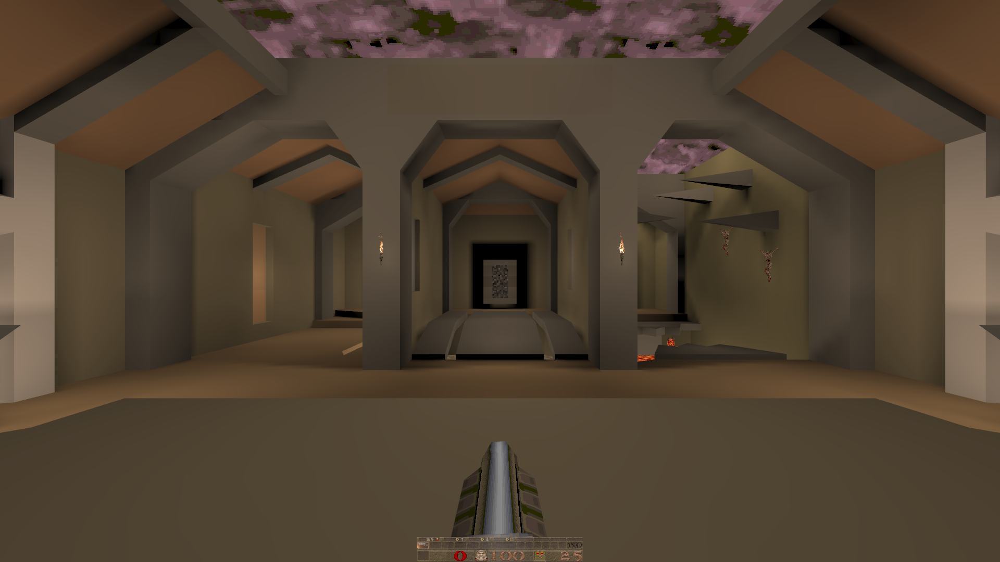

# libstrangle
Frame rate limiter for Linux.
## Usage
Cap the FPS (frames per second) of a chosen game by using the included script `strangle`
Example:
```
strangle 60 /path/to/game
```
### Vsync
Vertical sync can be controlled by setting the `STRANGLE_VSYNC` environment variable.

**OpenGL**
* -1 - Adaptive sync (unconfirmed if this actually works)
* 0 - Force off
* 1 - Force on
* n - Sync to refresh rate / n.

**Vulkan**
* 0 - Force off
* 1 - Mailbox mode. Vsync with uncapped framerate.
* 2 - Traditional vsync with framerate capped to refresh rate.
* 3 - Adaptive vsync with tearing at low framerates.

Examples:
```
STRANGLE_VSYNC=2 strangle /path/to/game
STRANGLE_VSYNC=1 strangle 40 /path/to/game
```
### Steam
You can use this with Steam by right-clicking on a game in your library and selecting Properties and then SET LAUNCH OPTIONS... under the General tab. In the input box type:
`strangle <somenumber> %command%`
### Options
Strangle can be controlled with environment variables.

| ENV VAR                               | Value | Explanation |
| ---                                   | ---   | ---:        |
| STRANGLE_FPS                          | <decimal> 0 to disable. Any positive value to enable. Non-integer values allowed. | Maximum framerate |
| STRANGLE_VSYNC                        | <int>  | See the above section on v-sync |
| STRANGLE_GLFINISH                     | 0 or 1 | Forces glFinish() to run after every frame |
| STRANGLE_PICMIP                       | -16 to 16 | Mip-map LoD bias. Negative values will increase texture sharpness (and aliasing). Positive values will increase texture blurriness |
| STRANGLE_AF                           | 1 to 16 | Anisotropic filtering level. Improves sharpness of textures viewed at an angle |
| STRANGLE_RETRO                        | 0 or 1 | Disables linear texture filtering. Makes textures look blocky. |
| STRANGLE_NODLSYM                      | 0 or 1 | Disables the hooking of dlsym |
| STRANGLE_VKONLY                       | 0 or 1 | Stops strangle's OpenGL libs from loading |
| ENABLE_VK_LAYER_TORKEL104_libstrangle | 0 or 1 | Enables the implicit Vulkan layer |
| DISABLE_VK_LAYER_TORKEL104_libstrangle | 0 or 1 | Disables the implicit Vulkan layer |
### Experimental stuff
*vkQuake with `STRANGLE_PICMIP=1337`*

You can adjust the mipmap lod bias in both opengl and vulkan with the environment variable `STRANGLE_PICMIP`. A higher value means blurrier textures. A negative value could make textures crisper.
## Building
Typically you'll use these commands to build the program
```
make
sudo make install
```

**Debian**, **Ubuntu** and derivates may need some or all of these packages:
```
gcc-multilib
g++-multilib
```

**OpenSUSE** needs these packages:
```
glibc-devel-32bit
gcc
gcc-32bit
```
## Notice
Might crash if used together with other libs that hijack dlsym, such as Steam Overlay. It seems to work with Steam Overlay when placed at the end of LD_PRELOAD for some reason.
